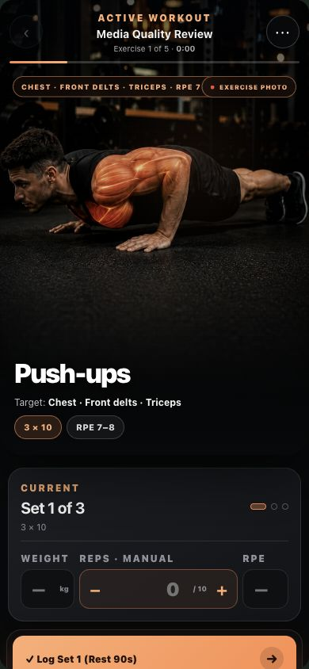
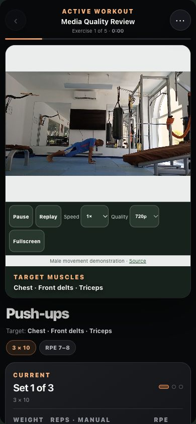

# Exercise media quality review — 8 October 2026

The quality upgrade replaces illustrated motion and photo morphing as the primary demonstration. A shared catalogue resolves standard plans, custom routines, substitutions, previews, the active player, tempo/timed dialogs and rest previews. Stable exercise names and saved logs remain compatible. `data/exercise-media.json` is the authoritative media inventory; `npm run sync` generates the client manifest and deployable files.

## Coverage and remaining work

| Reviewed status | Exercises | Treatment |
|---|---:|---|
| Approved video | 3 | Push-ups, Football Warm-up Jog, Football Cooldown Jog; two unique source clips |
| Approved photo-only | 40 | Real male reference photos, selectable photographed positions |
| Replacement needed: existing illustrations | 36 | Clearly labelled static illustrated references; original provenance is incomplete |
| Replacement needed: no approved asset | 13 | Exact exercise instructions and cues; no unrelated demonstration |
| Total | 92 | Every catalogue exercise has a recorded status |

The 36 illustrations remain interim references rather than approved real male photos or footage. The corrected Dead Hang reference has recorded image-generation provenance; the other existing references have incomplete original source/licence evidence. This implementation does not claim a complete real-footage library. Suitable free assets for every exercise have not been verified. No purchase, paid API, subscription or new hosting was introduced.

The thirteen exercises with no approved visual are Hanging Knee Raise, Banded Chest Press, Banded Row, Prone Bodyweight Row, Kneeling Lat Prayer, Dumbbell Hip Thrust, Banded Hip Thrust, Dumbbell Romanian Deadlift, Bodyweight Box Squat and Banded Squat, Hip Thrust Machine, Resistance Band Pulldown and Cable Pull-Through. The last three were removed after the phone review found incorrect equipment or movement. Their text is exercise-specific. Unknown imported names also use their own cue fallback.

## Sources and visual review

Approved footage comes from [Pexels](https://www.pexels.com/license/): [Push-ups, Ketut Subiyanto](https://www.pexels.com/video/man-doing-push-ups-4804794/) and [Jogging, RDNE Stock project](https://www.pexels.com/video/man-warming-up-on-a-soccer-field-7187117/). The jogging excerpt is used for relaxed jogging in place only; the corrected 8.4–9.525 second excerpt excludes the kick and cropped frames. It does not demonstrate shuffles, strides, walking or a football match. Neither creator nor athlete is presented as endorsing the app, and trainer qualifications are not asserted.

Real photographs come from [free-exercise-db](https://github.com/yuhonas/free-exercise-db/blob/main/README.md), whose README explicitly permits local use of its images and whose repository uses the [Unlicense](https://github.com/yuhonas/free-exercise-db/blob/main/LICENSE.md). Each accepted exercise records its individual image URLs, source page, declared licence, retrieval date, equipment, photographed view, image dimensions, review result and final content hash. This records the provider's declaration; it does not invent an original photographer credit.

The reference supplied by the user informed the layout: clearly separated positions, whole relevant body/equipment, bright media, and cues beside it. It was not copied into the asset library. Chest-Supported Row now uses the actual chest-supported T-bar machine reference; it does not borrow a seated cable row. Photo labels say Position 1/2 because source numbering does not consistently represent a start-to-finish order. Uncategorised photographed angles are recorded as such, never relabelled Front.

Visual review checks male presentation, exact movement and equipment, joint visibility, framing, stable footage and lighting. It is not a determination of a person's sex or a biomechanical/professional certification. No professional sign-off is claimed. The existing human technique-review workflow remains separate.

Rejected clips and photos are listed in the inventory with reasons: occluded leg-press movement, cropped stationary-bike/pulldown footage, an incorrect push-up variation, a standing curl for an incline curl, a pigeon stretch for a hip-flexor stretch, dark/cropped bench footage and an inverted-row photo with cropped feet. Female-presenting Dead Bug and Pallof candidates were not added.

## Preparation and display

Push-ups has a genuine native 3840 × 2160, 25 fps source; jogging has a 1080 × 1920, 24 fps source. Delivery retains these genuine frame rates. Free FFmpeg tools prepare H.264/yuv420p MP4s at 720p and 1080p, CRF 20, with faststart and no audio. There is no upscale, frame interpolation, motion fabrication, camera movement or heavy darkening. Matching WebP posters are extracted through PNG from the prepared 1080p clips. The push-up poster is 1920 × 1080, avoiding a 4K download for a compact phone stage. Real photographs retain their available native resolution, generally 850 × 567; they are not labelled 1080p.

The brighter, closer Ketut push-up excerpt replaces the earlier distant Rene framing. Clips are trimmed to the reviewed movement segment. Neither is claimed to loop seamlessly. Playback ends with a brief retained frame and a Replay action. Holds, breathing and internal contractions remain still references with cues. The fitted stage preserves the relevant body and equipment; decorative cropping remains limited to discovery thumbnails. Muscle names are adjacent text, not measured activation overlays.

`scripts/prepare-exercise-video.py` is an offline preparation helper for an already licensed and reviewed local source. It requires free FFmpeg and Pillow, skips delivery sizes larger than the source, and returns content-addressed asset metadata. It does not automatically download or approve media.

## Player, navigation and transitions

The primary controller and native video node remain intact during set logging, rep changes and timer updates. Play/pause, replay, fullscreen, 0.5×/0.75×/1× speed and a saved Auto/720p/1080p preference are real controls. Auto selects 720p on narrow screens and 1080p for fullscreen/wide screens. A blocked autoplay attempt leaves the poster and Play action. The poster remains until a decoded video frame is ready.

Collapsed previews are mounted only when expanded. Only the next exercise's first poster and selected video are preloaded; repeated logging does not restart that preload. Hidden, collapsed, offscreen and covered main media is paused. Enabling reduced motion pauses playback; a user can request Play explicitly.

Animations are explicit: 120 ms button feedback, 180 ms route fade with up to 8 px movement, 220 ms directional exercise media, 240 ms sheet entry/exit and 160 ms local set/media confirmation. Photos fade without simulated movement. Rapid route changes discard stale updates and restore focus after the winning render. Navigation/header controls stay stable during exercise changes. Swipe gestures do not start on logging inputs or playback controls. Reduced motion changes screens immediately.

View Transitions enhance route navigation where available. The normal opacity/transform fallback works without that API. General DOM changes no longer animate the page. Broad `transition: all` rules were removed.

## Downloads and offline use

Downloads include every available reference position plus the selected video variant. Size is visible before downloading; progress and cancellation retain completed files for retry. Cards disclose steps still needing approved media. Quota checks count missing files, so checking an already complete download needs no spare storage or network transfer.

The `rep-exercise-media-v1` cache persists across unrelated app releases. Filenames include hashes of actual content; changed assets get a different version. Downloads validate complete 200 responses and byte counts. A partial 206 response is never marked as a complete download. The service worker serves byte ranges from complete cached files for offline seeking, including suffix/open-ended ranges and invalid-range 416 responses. Errors leave the exercise's photo or cues available.

## Verification and release boundary

The current [training-first redesign report](TRAINING_FIRST_REDESIGN.md) contains the complete verification and recording evidence. The local headless restriction was resolved by launching Chrome outside the filesystem sandbox through the authorized test command. The final local checks pass: 209 Node tests, 10 Worker tests, 240 browser checks and eight encrypted-backup recovery checks. This does not certify physical phones or hosted CI for an unpublished commit.

Every inventory entry now records its phone-size review, including interim references and cue fallbacks. Nine contact sheets cover the reviewed reference positions at a fitted 336 × 178 px stage. Whole relevant joints and equipment, source identity, captions and natural movement were checked. The three incorrect illustrations are not displayed. No professional technique sign-off is asserted.

Current desktop Chrome measurements use a 390 × 844 viewport: LCP 84 ms, CLS 0.001 (rounded) and the largest observed event duration 40 ms. These are controlled local observations, not field p75 Web Vitals or physical-device measurements. Device Safari/Chrome, real keyboard, storage-pressure and slow-connection certification remain release requirements.

The new before/after recordings use actual browser video capture with fresh local fixtures. Their baseline is PR #99 head `7109ca8`; it is not a production recording. No merge or deployment is included in this redesign.

## Captured comparison

The baseline is the preceding local functional implementation, not a production recording. These screenshots were captured on 7 October, before the final focus-preservation adjustments.

| Before | After |
|---|---|
|  |  |

[Captured baseline walkthrough](media-review/before-walkthrough.mp4) uses the actual screenshot timestamps (100 frames over about 13 seconds). That earlier quality recording is archived; the training-first report links the current native browser recordings.
