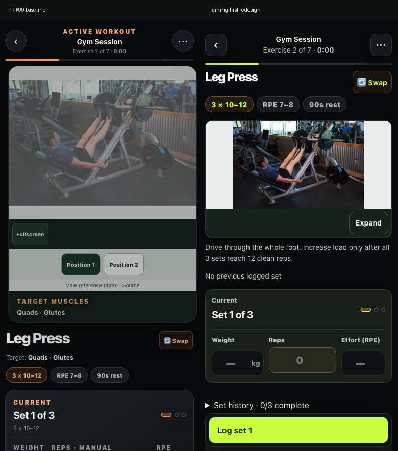

# Training-first redesign — implementation and review

The app now centres on starting and completing a workout. Today owns the daily decision, Train owns routines and planning, Nutrition keeps its own destination, Progress explains consistency and performance, and More groups supporting features. The existing router, durable store, workout lifecycle, catalogue, player, sync outbox, backup format and backend remain in use.

Implemented on `codex/training-first-redesign`, starting from PR #99 head `7109ca8`. The browser-tested client build is `803f5166949a`. PR #99 is a separate, draft foundation; this redesign does not merge or deploy either change.

## Delivered stages

| Stage | Result |
|---|---|
| Foundation and Today | Five destinations, compatible old route aliases, one daily workout action, direct resume, one readiness explanation with data age, quick recovery check-in and collapsed daily routines. The older cinematic roadmap is explicitly archived. |
| Workout flow | Exercise name and progress, compact fitted demonstration, technique cue, previous set, one current-set editor and persistent Log Set. Set history and tools are disclosures. Rest replaces Log Set and exposes remaining time, upcoming set, +15 seconds, Pause and Skip. Undo lives in the set card. Completion gives actual results, next-session guidance and Finish. |
| Supporting screens | Favourite routines, schedule editing and canonical exercise search/filtering; editable custom routines; food/water summary and manual meal entry; searchable history, exercise estimates and retained detailed analytics; Recovery, routines, Connections and Settings in More. |
| Media and verification | All 92 inventory entries reviewed at phone size. Brighter, closer male push-up footage and a corrected jogging excerpt. Three incorrect illustrations removed. Local tests, recovery drill, screenshots and native before/after recordings completed. Physical device certification is pending. |

## Behaviour and compatibility

Suggested set values come from an accepted next-session target or actual prior logs. They stay editable and are not counted as complete until logged; an unknown starting load is blank. Field edits, logging and timer updates keep the native media player and playback position. Quality remains saved; speed, source credits, photographed positions and fullscreen are inside Expand.

Busy-equipment swaps default to the active session. Existing permanent substitutions remain compatible; session choices take precedence and expire at completion or explicit abandonment. Each completed set records the exercise actually performed, including a swap midway through an exercise. Editing a completed row updates that exercise's log. Timed, warm-up and sport steps retain editable completion rows in the same set history. Undo restores the preceding completion and rest state. Routine editing is blocked while that routine is active.

Favourites, display preferences and active-session choices use the existing persisted state and encrypted exports. A fresh-profile restore preserved these fields, habits and meals; damaged exports were rejected. Save labels distinguish local records, pending sync and previously synced records without claiming preferences were remotely synced. Missing wearable observations allow manual logging; existing pain/illness warnings remain accessible from Today and routine previews.

Screen composition has an explicit owner in `training-first-ui.js`. Existing modules export their reusable views and bindings. The general product-UI mutation observer and layered Today/Train decorators have been removed. Legacy page implementations remain for gradual reuse. Main navigation uses 180 ms opacity/transform transitions, exercise media 220 ms, sheets 240 ms and local feedback 160 ms, with reduced-motion support. Superseded transitions cancel; workout controls do not animate with every field change.

## Media coverage

| Status | Exercises | Published treatment |
|---|---:|---|
| Approved video | 3 | Push-ups and two easy-jog contexts; two unique source clips, matching posters and native 720p/1080p variants |
| Approved photo-only | 40 | Real male references and available photographed positions |
| Replacement needed | 36 | Explicitly labelled static illustrations; original provenance remains incomplete |
| Replacement needed | 13 | Exact technique cues; no mismatched exercise image |
| Total | 92 | Every entry has a recorded phone review |

[Coverage CSV](media-review/coverage.csv), [authoritative inventory](../data/exercise-media.json) and [source/licence register](THIRD_PARTY_MEDIA.md) retain equipment, camera labels, sources, declared rights and review results. The adult male demonstration standard remains. No qualifications, endorsement, measured activation or professional technique certification are claimed.

Push-ups uses [Ketut Subiyanto's Pexels clip](https://www.pexels.com/video/man-doing-push-ups-4804794/), native 3840 × 2160 at 25 fps, delivered without upscaling or interpolation. Its 1920 × 1080 poster is an exact frame from the prepared clip. The [RDNE jogging source](https://www.pexels.com/video/man-warming-up-on-a-soccer-field-7187117/) is trimmed to 8.4–9.525 seconds of relaxed jogging in place; the kick and clipped-body segment were excluded. Replay is explicit because neither clip has an approved seamless join. The [Pexels licence](https://www.pexels.com/license/) was rechecked on 8 October. No asset purchases, runtime stock API or new hosting were introduced.

Hip Thrust Machine, Resistance Band Pulldown and Cable Pull-Through illustrations failed equipment/movement review and now use cues. Remaining replacements are listed openly. Priority remains frequently used gym exercises, activation and favourite routines. A complete consistent real-footage library is not claimed.

## Verified evidence

| Gate | Result |
|---|---|
| `npm run sync` and `npm run verify` | 209 Node tests and 10 Worker tests pass; syntax, lint, types, configuration, canonical health data and media hashes pass |
| `npm run test:e2e` | 240/240 Chrome browser checks; no console/page errors |
| `npm run test:recovery` | 8/8 authenticated export/restore and tamper-rejection checks |
| Phone layouts | 320, 360, 375, 390, 414 and 430 px; key inputs and Log Set jointly visible at 390 × 844, 360 × 780 and 320 × 667; primary navigation targets ≥44 px |
| Accessibility | No serious/critical axe violations in the five destinations, quick check-in, current-set editor, rest or completion. Keyboard focus trapping in the new check-in sheet, doubled text and landscape reflow checked. |
| State and media | Undo, timed exercises, session-only and midway swaps, actual exercise history, encrypted preference restore, rest target and pause/resume, native player continuity, cold offline reload, exact cached ranges, interrupted downloads and rejected partial 206 responses checked |

[Browser metrics](training-first/metrics.json) are controlled **desktop Chrome observations** at phone viewports: LCP 84 ms, CLS 0.001 (rounded) and largest observed interaction duration 40 ms. This meets the local measurement budgets; it is not field p75 INP, a mobile network benchmark or phone hardware certification. The walkthrough separately measured 1,015 requestAnimationFrame intervals: median 16.7 ms, p95 16.7 ms, maximum 66.6 ms, with 2 intervals above 33.4 ms. This supports mostly 60 Hz desktop pacing and also records the exceptions. Do not infer smooth physical-device performance from these observations.

The local browser sandbox restriction was resolved using the authorized outside-sandbox Chrome test command. Browser recording fixtures use a fresh local profile, the same gym session and the same 40 kg / 10 reps / RPE 7 input values. The exercise index is selected explicitly for comparison. No personal browser data is captured.

| Baseline: PR #99 | Training-first redesign |
|---|---|
| [Native browser walkthrough](training-first/before-walkthrough.mp4) | [Native browser walkthrough](training-first/after-walkthrough.mp4) |
| [Capture metadata](training-first/before-capture.json) | [Capture metadata](training-first/after-capture.json) |

[Today](training-first/after-today.png), [Train](training-first/after-train.png), [Nutrition](training-first/food.png), [Progress](training-first/insights.png), [More](training-first/more.png), [Rest](training-first/after-rest.png), [Completion](training-first/completion.png), [encrypted recovery report](training-first/recovery.json).

## Release requirements still open

Physical iPhone Safari and Android Chrome checks are required before release: portrait/landscape, real on-screen keyboard, VoiceOver/TalkBack, 200% system text, interruptions, saved-session relaunch, storage pressure, slow connections and frame pacing on representative hardware. Desktop axe and viewport tests support that work and do not substitute for it. The 49 replacement-needed media entries and unverified legacy provenance remain visible in the register.

The first hosted run exposed a contrast check made during the media entrance animation. Exercise transitions now target only the media surface, keeping playback controls stable; accessibility checks wait for running finite animations with a bound. The corrected local suite also passes without screenshot delays. Hosted verification must run against the exact pushed head. A stacked draft targets the PR #99 branch so its review shows this redesign separately. After the foundation lands, retarget/rebase onto main and run the main-targeted CodeQL/security checks. Merge and production deployment require the user's release instruction.

## Reproduction

Run `npm run sync`, `npm run verify`, `npm run test:e2e` and `npm run test:recovery`. To retain screenshots, video and metrics, set `REP_E2E_CAPTURE_DIR` to an output folder when running the browser suite.

`node scripts/record-redesign.mjs` captures a fresh-profile local walkthrough. `REP_RECORD_CLIENT_ROOT` can point at a `git archive` extraction of the baseline's `dist/client`; `REP_RECORD_VARIANT` names the capture and `REP_RECORD_OUTPUT` selects its output folder. The recording helper uses port 8937, separate from the regression and recovery fixtures, and never publishes the app.
